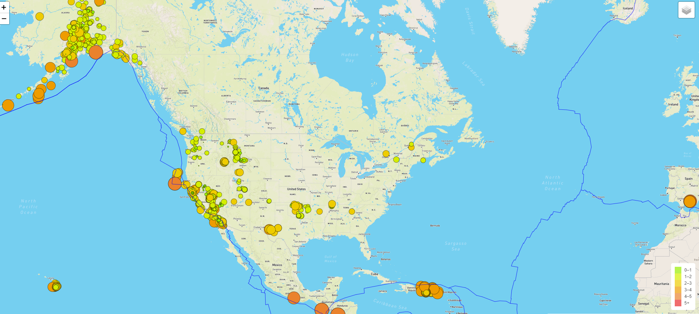
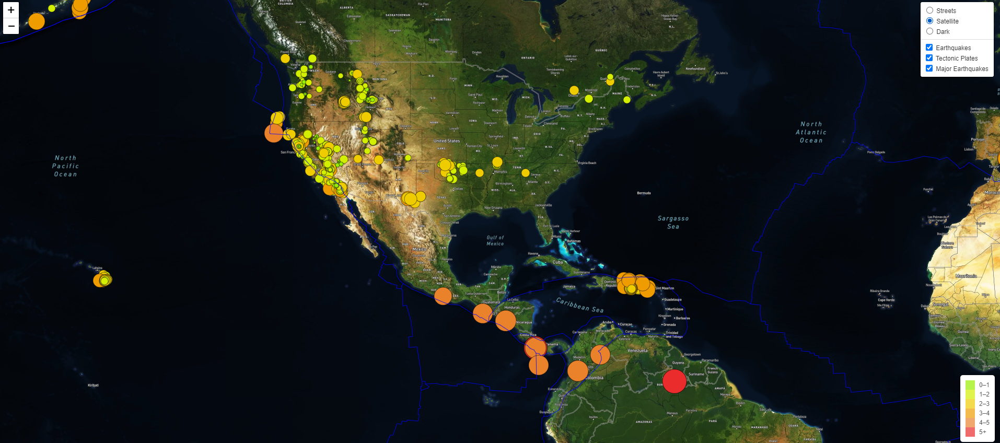
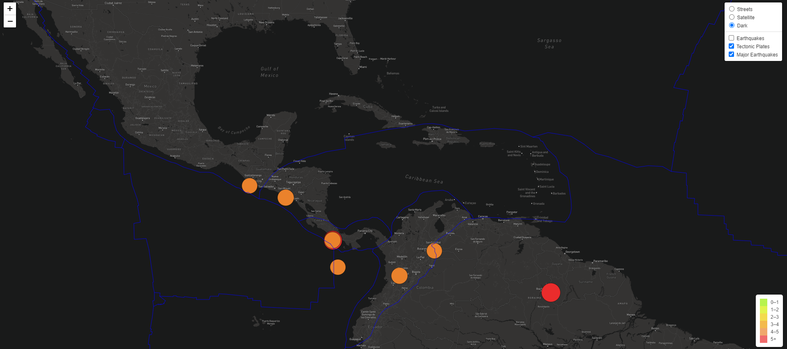

# Mapping_Earthquakes

# Background
The purpose of this project is to visually show the differences between the magnitudes of earthquakes all over the world for the last seven days.  This was done by taking advantage of D3.js and Leaflet.js libraries, to take GeoJSON earthquake data (taken from the USGS website's real-time feed: https://earthquake.usgs.gov/earthquakes/feed/v1.0/geojson.php) and plot it on an interactive map.  To generate the map layers, the Mapbox API was used.

# Result
Each earthquake is visually represented by a circle and color, where higher magnitudes will have a larger diameter and darker in color:
### Figure 1 - Dynamic Circle Markers based on Magnitude
</img>

Multiple map terrain was also added for variability of visibility:
### Figure 2 - Satellite map images
</img>

Lastly, toggle-able data such as where the tectonic plates are located as well as filtering specifically to major earthquakes that registered magnitudes 4.5 or higher can be chosen:
### Figure 3 - Toggling to Major Earthquakes in Dark mode
</img>
